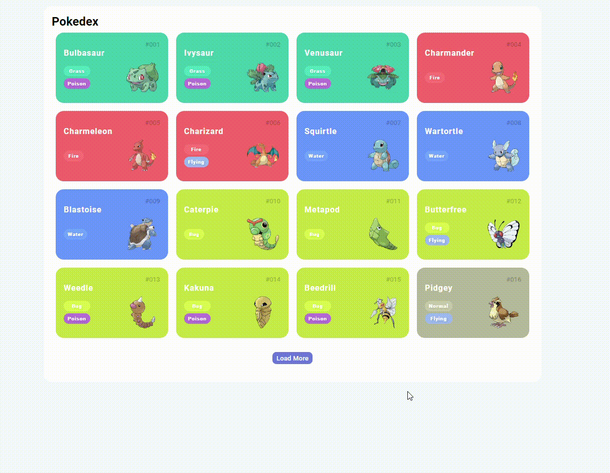

<h1 align="center">Construindo uma Pokédex com JavaScript</h1>
<p align="center">Desafio da Trilha JS Developer - Dio</p>

## Technologias

- Html
- CSS
- JavaScrit

## Como clonar esse projeto

```
git clone https://github.com/geanmm/challenge-one-text-encryption.git
```

## View

<p align="center">
  
</p>
